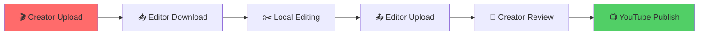

<div align="center">

# 🎬 FlarePP

### **Video Collaboration Platform for Creators & Editors**

[](https://reactjs.org/)
[](https://nodejs.org/)
[](https://mongodb.com/)
[](https://tailwindcss.com/)

**Seamless video editing workflow between creators and editors**

---

</div>

## 🚀 Quick Start

```bash
# Clone & Install
git clone https://github.com/username/FlarePP.git
cd FlarePP
npm install
cd client && npm install

# Start Development
npm run dev          # Backend
cd client && npm run dev  # Frontend
```

---

## ✨ Features

### 🎯 **Creator Dashboard**
- 📤 **Video Upload** → YouTube API + Cloud Storage
- 👀 **Review System** → Preview edited videos
- 📺 **Publish** → Direct YouTube publishing
- 📊 **Analytics** → Performance tracking

### ✂️ **Editor Workspace**
- 📥 **Download** → Access creator videos
- 🎬 **Local Editing** → Professional tools
- 📤 **Re-upload** → Submit edited versions
- 💬 **Communication** → Real-time messaging

### 🔐 **Security & Auth**
- 🔑 **Google OAuth 2.0** → Secure login
- 👥 **Role-based Access** → Creator/Editor roles
- 🔒 **JWT Tokens** → Session management

---

## 🛠 Tech Stack

| **Frontend** | **Backend** | **Database** | **Services** |
|--------------|-------------|--------------|---------------|
|  |  |  |  |
|  |  |  |  |
|  |  |  |  |

---

## 📁 Project Structure

```
FlarePP/
├── 🎬 api/                 # Backend API
│   ├── 📊 controllers/     # Business logic
│   ├── 🛣️ routes/         # API endpoints
│   ├── 📋 models/         # Database schemas
│   └── 🔧 middlewares/    # Auth & validation
├── 🎨 client/             # React Frontend
│   ├── 🧩 components/     # UI components
│   ├── 📄 pages/          # Page components
│   ├── 🔄 redux/          # State management
│   └── 🎯 hooks/          # Custom hooks
└── 📦 package.json         # Dependencies
```

---

## 🔄 Workflow



---

## 🚀 Getting Started

### 1️⃣ **Environment Setup**
```bash
# Create .env file
cp .env.example .env

# Configure variables
MONGO_URI=mongodb://localhost:27017/flarepp
YOUTUBE_API_KEY=your_youtube_api_key
JWT_SECRET=your_jwt_secret
```

### 2️⃣ **Install Dependencies**
```bash
# Backend
npm install

# Frontend
cd client && npm install
```

### 3️⃣ **Start Development**
```bash
# Terminal 1 - Backend
npm run dev

# Terminal 2 - Frontend
cd client && npm run dev
```

---

## 📊 API Endpoints

| **Method** | **Endpoint** | **Description** |
|------------|--------------|-----------------|
| `POST` | `/api/auth/login` | 🔑 User authentication |
| `POST` | `/api/videos/upload` | 📤 Upload video metadata |
| `GET` | `/api/videos` | 📋 List available videos |
| `POST` | `/api/videos/reupload` | 📤 Submit edited video |
| `POST` | `/api/videos/publish` | 📺 Publish to YouTube |

---

## 🎯 Key Features

- 🔄 **Real-time Updates** → WebSocket notifications
- 📱 **Responsive Design** → Mobile-first approach
- 🎨 **Modern UI** → TailwindCSS + Radix UI
- 🔐 **Secure Auth** → Google OAuth + JWT
- 📊 **Analytics** → Performance tracking
- 💬 **Messaging** → Creator-Editor communication

---

<div align="center">

## 🤝 Contributing

[](http://makeapullrequest.com)

**Fork → Feature → Pull Request**

---

## 📄 License

[](https://opensource.org/licenses/MIT)

**Made with ❤️ by the FlarePP Team**

---

[](https://github.com/username/FlarePP)
[](https://github.com/username/FlarePP)
[](https://github.com/username/FlarePP)

</div>
